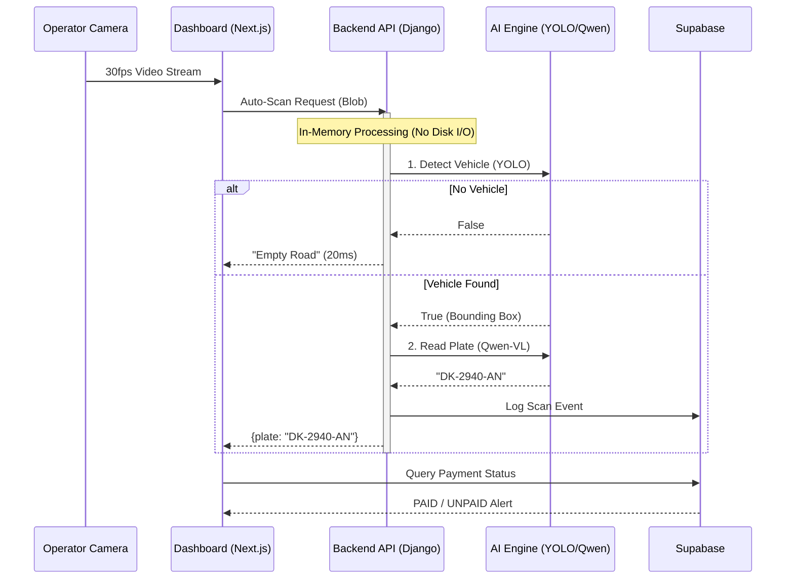

# TaxiGuard: Enterprise Municipal Checkpoint System 🚕🛡️


**TaxiGuard** is an AI-powered automated checkpoint platform designed to modernize municipal revenue collection and traffic regulation in Senegal. It replaces manual, paper-based verification with a high-speed, zero-touch computer vision system.

---

## ⚡ Key Features

*   **"Two-Brain" AI Engine**:
    *   **Edge**: YOLOv8 Nano for 50ms vehicle detection (Local CPU).
    *   **Cloud**: Qwen2-VL (7B) for high-precision License Plate Recognition (OCR).
*   **Zero-Lag Operations**:
    *   **Recursive Polling System**: Guarantees no network request stacking, ensuring stability even on 4G.
    *   **In-Memory Pipeline**: Images are processed in RAM (YOLO -> Crop -> API) without touching the hard disk, reducing latency by 90%.
*   **Fiscal "Pass or Pay" Logic**:
    *   Automatic lookup of vehicle registration and daily tax status.
    *   instant "Green Light" / "Red Light" operator feedback.
*   **Real-Time Sync**: Supabase WebSockets push scan events to the dashboard instantly.

---

## 🏗️ Technical Architecture

TaxiGuard utilizes a **Hybrid Edge-Cloud Architecture** to minimize costs and maximize speed.



---

## 🛠️ Technology Stack

| Component | Technology | Rationale |
| :--- | :--- | :--- |
| **Frontend** | **Next.js 14** (TypeScript) | Type-safe, high-performance UI with Server Actions. |
| **Backend** | **Django 5.0** (Python) | Robust API handling and easiest integration with PyTorch/AI libs. |
| **Database** | **Supabase** (Postgres) | Real-time subscriptions and Row Level Security (RLS). |
| **AI Inference** | **Ultralytics + OpenRouter** | Best-in-class object detection paired with semantic vision capabilities. |
| **Deployment** | **Vercel + Local** | Hybrid deployment for low-latency edge caching. |

---

## 🚀 Getting Started

### Prerequisites
*   Node.js 18+
*   Python 3.10+
*   Supabase Account

### Installation

1.  **Clone the Repository**
    ```bash
    git clone https://github.com/utachicodes/taxi-checkpoint-system.git
    cd taxi-checkpoint-system
    ```

2.  **Frontend Setup**
    ```bash
    pnpm install
    # Create .env.local with NEXT_PUBLIC_SUPABASE_URL and ANON_KEY
    npm run dev
    ```

3.  **Backend Setup**
    ```bash
    cd vision
    python -m venv venv
    source venv/bin/activate  # or venv\Scripts\activate on Windows
    pip install -r requirements.txt
    # Create .env with OPENROUTER_API_KEY and SUPABASE_SERVICE_KEY
    python manage.py runserver
    ```

4.  **Launch**
    *   Frontend running on `http://localhost:3000`
    *   Backend running on `http://localhost:8000`

---

## 🔒 Security

*   **RBAC**: Strict role separation between Operators (Read/Write Payments) and Admins (Full Access).
*   **Audit Trail**: Every AI detection creates an immutable record in `scan_events`.
*   **Encryption**: All API keys stored in environment variables; DB connection over SSL.

---

## 📄 License & Credits

**Copyright © 2025 UtachiCodes.**  
Built for the **Municipality of Somone**.  
*All Rights Reserved.*