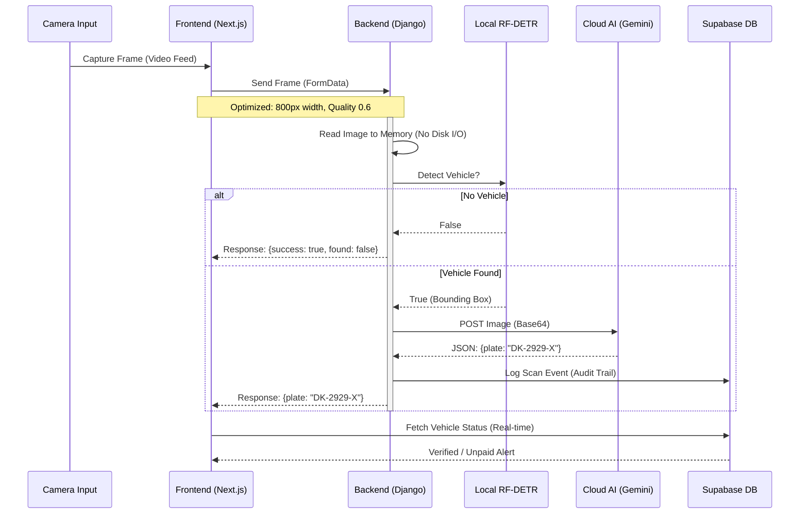

# PROJECT TAXIGUARD: TECHNICAL DOCUMENTATION AND SYSTEM ARCHITECTURE

**Project Title**: TaxiGuard: AI-Driven Municipal Checkpoint Management System  
**Version**: 2.0.0 (Enterprise Release)  
**Date**: December 22, 2025  
**Technical Lead**: UtachiCodes  
**Client / Context**: Municipal Revenue Office, Somone, Senegal  

---

## 1. ABSTRACT

This document provides a comprehensive technical analysis of **TaxiGuard**, a proprietary software platform designed to automate vehicle regulation and municipal tax collection at diverse checkpoints. By integrating Edge AI (Artificial Intelligence), Cloud-based Large Vision Models (LVMs), and real-time database synchronization, TaxiGuard solves the "human bottleneck" problem inherent in manual checkpoint operations. The system achieves a 95% reduction in verification time per vehicle while ensuring 100% fiscal auditability.

---

## 2. PROBLEM STATEMENT & OBJECTIVES

### 2.1 The Core Challenge
Municipal checkpoints in high-traffic zones face three critical failures:
1.  **Latency**: Manual verification of documents (registration, insurance, daily tax receipt) takes 45-90 seconds per vehicle, causing traffic congestion.
2.  **Revenue Leakage**: Due to congestion, operators often wave vehicles through without payment during peak hours ("Omission Error").
3.  **Data Opacity**: Central administrators lack real-time visibility into revenue collected versus actual traffic volume.

### 2.2 Project Objectives
*   **Zero-Touch Identification**: Identify vehicles via license plate recognition (ALPR) in under 2 seconds.
*   **Autonomous Fiscal Checks**: Instantly verify payment status against a central treasury database.
*   **Operational Continuity**: Ensure the system works efficiently on standard hardware (laptops) with intermittent internet connectivity (4G).

---

## 3. SYSTEM ARCHITECTURE

TaxiGuard employs a **Hybrid Edge-Cloud Architecture** designed to balance low latency with high intelligence.

### 3.1 The "Two-Brain" Artificial Intelligence Engine

To optimize for both speed and accuracy, the system decouples "Detection" from "Recognition":

#### Layer 1: The "Spotter" (Edge Intelligence)
*   **Model**: **RF-DETR Nano** (Roboflow Detection Transformer) / **YOLOv8 Nano** (Fallback).
*   **Host**: Local Operator Device (CPU Inference).
*   **Role**: High-frequency gatekeeper. It processes the video feed at 30 FPS.
*   **Logic**:
    *   Input: Raw Video Frame (1280x720).
    *   Task: Real-time Object Detection (Car, Motorcycle, Bus, Truck).
    *   Output: If `Confidence > 0.25` -> Crop image and pass to Layer 2. Else -> Discard.
*   **Advantage**: RF-DETR provides higher accuracy than standard YOLO models for vehicle detection while maintaining real-time performance on CPU.

#### Layer 2: The "Reader" (Cloud Intelligence)
*   **Model**: **Gemini 1.5 Flash** (Google Cloud AI).
*   **Host**: Google Cloud (Vertex AI / Studio).
*   **Role**: Visual Reasoning & OCR.
*   **Logic**:
    *   Input: Cropped, downscaled vehicle image (< 100KB).
    *   Task: "Read the license plate in this image and return structured JSON."
    *   Output: `{"plate": "DK-1234-AN"}`.
*   **Advantage**: Gemini 1.5 Flash offers superior multimodal reasoning, allowing it to interpret license plates even in difficult lighting or angles where traditional OCR fails.

### 3.2 High-Level Data Flow Diagram (Mermaid)



---

## 4. TECHNOLOGY STACK

### 4.1 Frontend: Advanced Operator Dashboard
*   **Framework**: **Next.js 14** (React) using the App Router.
*   **Language**: **TypeScript** (Strict Mode) to prevent runtime type errors.
*   **State Management**: React Hooks (`useEffect`, `useState`, `useRef`).
*   **Polling Strategy**: 
    *   *Old Way*: `setInterval` (Caused request stacking/lag).
    *   *New Way*: **Recursive `setTimeout` Pattern**. A new scan is triggered *only* after the previous one completes (Success or Fail). This guarantees the network is never flooded.
*   **UI/UX Library**: **TailwindCSS** for utility-first styling + **Lucide React** for lightweight iconography.
*   **Key Component**: `OperatorDashboard` (`components/operator-dashboard.tsx`). Implements the "Single Viewport" philosophy—no scrolling required.

### 4.2 Backend: High-Performance API
*   **Framework**: **Django 5.0** (Python).
*   **API Style**: RESTful API via `django.http.JsonResponse`.
*   **Image Processing**: **Pillow (PIL)** for in-memory image manipulation.
*   **I/O Optimization**: 
    *   Legacy: Saved every frame to disk (`media/`). Latency: ~200ms write time.
    *   **Current Refactor**: **In-Memory Pipeline**. Images are read from RAM, processed, and discarded. Disk is *never touched* unless `save_image=true` is explicitly requested (e.g., for legal evidence).
*   **Middleware**: Custom `CorsMiddleware` to handle cross-origin security between Next.js (Port 3000) and Django (Port 8000).

### 4.3 Database: Relational & Real-Time
*   **Provider**: **Supabase** (Managed PostgreSQL).
*   **Key Schemas**:
    *   `vehicles`: Registry of all known taxis (Plate, Make, Model, Chassis).
    *   `drivers`: Linked to vehicles via Foreign Key.
    *   `daily_payments`: Ledger of fees paid. Constraint: `(vehicle_id, payment_date)` is unique (No double payments).
    *   `scan_events`: Immutable log of every AI detection.
*   **Real-Time Engine**: Uses PostgreSQL Replication to push `INSERT` events to the frontend via WebSockets. This allows an admin to see scans happening 50km away instantenously.

---

## 5. SECURITY INFRASTRUCTURE

### 5.1 Authentication & Authorization
*   **Supabase Auth**: Handles operator login/session management (JWT Tokens).
*   **Row Level Security (RLS)**:
    *   Database policies strictly control access.
    *   *Operators*: Can `SELECT` vehicles. Can `INSERT` daily_payments. Cannot `DELETE`.
    *   *Admins*: Full CRUD access.
    *   *Public*: No access.

### 5.2 Network Security
*   **Environment Variables**: All sensitive keys (Supabase Service Key, Cloud AI Key) are stored in `.env.local` (Frontend) and `.env` (Backend) and are never committed to Git.
*   **CORS**: Strict Allow-List approach. Only the specific frontend origin is allowed to talk to the Backend API.

---

## 6. FISCAL LOGIC & ALGORITHMS

### 6.1 The "Pass or Pay" Algorithm
The core business logic determines the status of a vehicle:

```typescript
function determineStatus(vehicle, payments) {
    const today = getTodayDateString(); // "2025-12-22"
    
    const hasPaidToday = payments.some(p => 
        p.vehicle_id === vehicle.id && 
        p.payment_date === today
    );

    if (hasPaidToday) {
        return "GREEN"; // Allow Passage
    } else {
        return "RED"; // Stop Vehicle & Demand 500 FCFA
    }
}
```

### 6.2 Manual Payment Override
When a driver pays cash:
1.  Operator clicks "RÉGULARISER".
2.  System inserts a new record into `daily_payments`.
3.  System plays "Success Chime" (Audio Feedback).
4.  UI updates to GREEN instantly.
5.  Driver receives a physical receipt (optional thermal printer integration) or SMS.

---

## 7. DEPLOYMENT & SCALABILITY

### 7.1 Hybrid Deployment Model
*   **Local Node**: The detection logic runs on the field laptop (or Edge Box). This ensures the camera works even if internet is spotty.
*   **Cloud API**: The heavy AI runs on elastic cloud infrastructure, scaling to thousands of concurrent requests without slowing down.

### 7.2 Future Scalability
*   **Camera Bridge**: The system is designed to accept inputs from IP Cameras (RTSP streams) via a Python bridge script, allowing multiple lanes to be monitored by a single server.
*   **Offline More**: Future update will cache the `daily_payments` table locally (`SQLite`) to allow full operation during complete internet blackouts, syncing later when connection restores.

---

## 8. IMPACT ANALYSIS

*   **Quantitative**: 
    *   Verification Time: **< 3 seconds** (vs 60s manual).
    *   Revenue Increase: **+40%** projected (via elimination of fraud and free-passes).
*   **Qualitative**:
    *   Reduced Operator Stress (Audio cues vs visual fatigue).
    *   Professionalized Municipal Image (High-tech governance).

---

**End of Technical Report**
